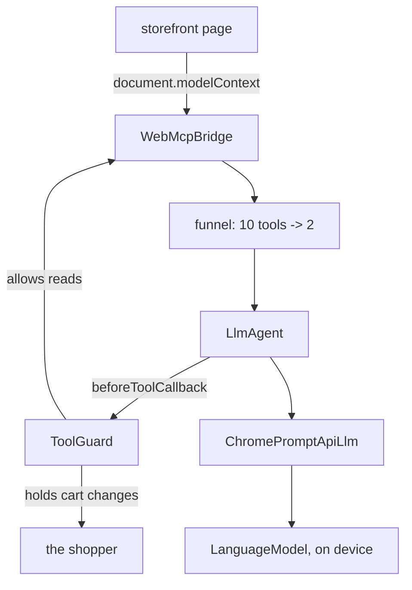

# Sidecart: an on-device assistant driving a store's own tools (TypeScript)

This project implements a Chrome side-panel shopping assistant. It runs on the
language model Chrome ships with the device, and it acts on a storefront
through the tools **the storefront itself publishes** over
[WebMCP](https://developer.chrome.com/docs/ai/webmcp) — it never reads the
page's HTML and never clicks a button.

Shopify registers ten WebMCP tools on every Liquid storefront, with no work by
the merchant. This assistant reads those ten and drives them.

## Overview

Sidecart exists to demonstrate three things:

1. **ADK runs in a browser.** The agent, the runner, the tools and the session
   service are the published `@google/adk` package, imported directly and
   bundled with no shims.
2. **ADK can drive an on-device model**, through a custom `BaseLlm` over
   Chrome's Prompt API.
3. **ADK is what makes WebMCP safe to use.** `document.modelContext.executeTool()`
   has no opinion about safety. The agent loop is where a human gate belongs.

Each of the three covers a weakness in the others. WebMCP collapses "understand
this page" into "choose one of these typed tools", which is what makes a small
on-device model workable here. The model keeps the shopper's reasoning on the
device. ADK supplies the loop, the tool callbacks and the place to stand
between the model and the cart.

The TypeScript angle is not incidental: WebMCP tools live in the page's
JavaScript context, so a Python process cannot reach them at all.

## Agent Details

| Feature            | Description                                          |
| ------------------ | ---------------------------------------------------- |
| _Interaction Type_ | Conversational                                       |
| _Complexity_       | Advanced                                             |
| _Agent Type_       | Single agent over a dynamic toolset                  |
| _Components_       | Custom `BaseLlm`, dynamic `BaseTool`s, tool callbacks |
| _Runtime_          | Browser: Chrome extension and web page               |
| _Model_            | Chrome's built-in on-device model                    |
| _Vertical_         | Retail                                               |

### Agent Architecture



WebMCP tools belong to a *document*, and a side panel is a different one, so a
content script bridges the two. `WebMcpBridge` is an interface for exactly that
reason: the agent, the funnel and the guard cannot tell whether they are
talking to a page or to a message port, which is also what lets the offline
harness reuse the same code.

### The two problems this solves

**Ten tools do not fit.** Measured on a live storefront, Shopify's ten tools
carry **10,469 characters** of description and JSON schema — roughly 3,000
tokens the model must read before the shopper types anything. Three of those
descriptions exceed the 500 characters Chrome's own guidance recommends,
because they are written for large cloud agents.

So tools go through a funnel:

```
all tools --> 1. menu     name + one line each, no schemas      856 chars
          --> 2. select   one bounded call: which apply?
          --> 3. equip    full schemas, chosen tools only     ~650-2,400 chars
```

Choosing from a short list is a small model's best kind of question, and the
expensive detail only reaches the two or three tools that survive. The panel
shows the number as it works, and it differs per question.

Narrowing turned out to be a safety property as well as a context one: a tool
that was never equipped cannot be called, whatever the page talks the model
into.

**Page text gives orders.** Chrome marks tools that return third-party content
with `untrustedContentHint`, and Shopify sets it on five of its ten — product
titles, reviews and policy pages are written by people who are not the shopper.
The model reads that text in the same token stream as the request, so a product
title can read as an instruction.

Chrome's guidance is that safety cannot be guaranteed inside a model. So the
guarantee is not in the prompt:

> **No tool that changes the cart runs without a person clicking.**

The model proposes. A person disposes. That holds whether or not the model was
fooled, which is what makes it worth relying on.

### Key Features

- **Drives tools the site published.** No DOM scraping, no synthetic clicks.
- **A visible funnel.** The panel reports how much of the tool surface was sent
  to the model, per question.
- **A human gate on every cart change**, showing the exact line items, marking
  any the shopper never asked for, and offering to add only the rest.
- **Injection detection.** Suspicious phrasing in untrusted tool output is
  flagged. This is a heuristic and it is evadable — the gate is the defence.
- **An offline harness** that registers Shopify's real ten tool definitions,
  copied verbatim from a live store, so the demo needs no network and poses the
  same problem.
- **An honest fallback.** With no usable model the app runs a scripted stand-in
  and says so in a badge that cannot be missed.

#### Tools

Sidecart defines **no tools of its own.** Every tool comes from the page. On a
Shopify storefront that is:

`search_catalog`, `browse_store`, `get_product`, `show_variant`, `get_cart`,
`update_cart`, `cancel_cart`, `proceed_to_checkout`, `manage_orders`,
`search_shop_policies_and_faqs`.

`WebMcpTool` in [`src/core/webmcp.ts`](src/core/webmcp.ts) adapts each
descriptor into an ADK `BaseTool`.

## Setup and Installation

### Prerequisites

- **Chrome 138 or newer** for the extension. Chrome 148+ for the harness as a
  web page.
- **Desktop only.** macOS 13+, Windows 10/11, Linux, or ChromeOS on Chromebook
  Plus.
- **22 GB free disk**, and either more than 4 GB of VRAM or 16 GB of RAM with
  4 or more cores.
- **Node.js 20 or higher** to build.

```bash
npm run doctor
```

### Installation

```bash
npm install
```

> **One extra step, for now.** This sample imports `@google/adk` directly and
> bundles it for the browser, which works once
> [#614](https://github.com/google/adk-js/pull/614) and
> [#618](https://github.com/google/adk-js/pull/618) are in a published release.
> Until then, run:
>
> ```bash
> npm run patch:adk
> ```
>
> That patches the installed copy in `node_modules` to look the way the
> released package will: one bundled browser entry, and the `browser` export
> condition. It changes nothing in this repository, and `npm ci` undoes it.
> When the release lands, `scripts/patch-adk.mjs`,
> `scripts/adk-browser-shims/` and this note all delete.

## Running the Agent

### Offline, against the stand-in storefront

```bash
npm run serve
```

Open <http://localhost:8901/harness.html>.

The page serves Shopify's own ten tool definitions, copied verbatim from a live
store, so the funnel is solving the real problem and the figures on screen are
the real figures. Once loaded it makes no requests of its own.

### On a real Shopify store

```bash
npm run build
```

1. Go to `chrome://extensions`
2. Turn on **Developer mode**
3. **Load unpacked**, and select `dist/`
4. Open a Shopify storefront and **reload the tab**
5. Press **Ctrl+Shift+U**, or **Cmd+Shift+U** on macOS

Reloading matters: a content script does not attach to tabs that were already
open, and the panel reaches the store's tools through it.

Nothing here is Shopify-specific — it reads whatever tools a page registers.

### Things to try

- `what waterproof jackets do you have?`
- `what is your return policy?`

  A different tool is chosen, and the figure changes.

- Tick **Add a listing that targets the assistant** in the strip at the top,
  then ask `add the alpine glove liner to my cart`

  A product title now carries an instruction aimed at the assistant. Watch what
  the panel does with it.

## Commands

```bash
npm run serve       # build and serve the harness on :8901
npm run build       # build the extension into dist/
npm run dev         # rebuild on change
npm test            # 82 tests
npm run record      # drive the demo and write demo.mp4 (needs ffmpeg)
npm run typecheck
npm run check       # typecheck, build, test
npm run doctor      # can this machine run the model?
```

## What is honest to claim

- **The reasoning is local.** No prompt, no page content and no conversation is
  sent to a model provider. There is no model server in this system.
- **Search terms do reach the store.** The assistant puts the shopper's words
  into `search_catalog`, and the store runs it — the same request its own
  search box would make. Calling this offline would be false.
- **The model never performs a side effect.** It proposes; a person confirms.
- **Prompt injection is not solved.** Chrome's own guidance says it cannot be
  solved inside a model. What is solved is that a fooled model still cannot
  spend money.
- **No cost claim.** There is no token meter here, so there is no baseline.

## License

Apache 2.0. See [LICENSE](LICENSE).

Demonstration code, not a supported product.
